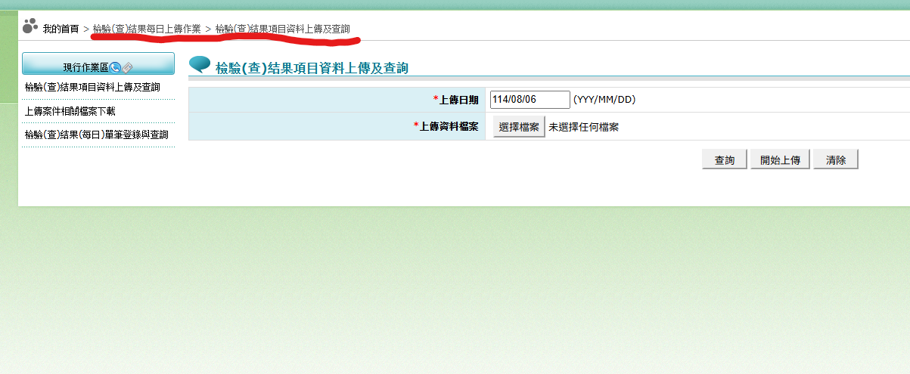

# 血壓紀錄批次檔生成器_for展望系統 v2.0 Ultra 操作說明

> 📝 簡單易懂的操作指南，幫助您快速上手血壓資料匯出

## 📋 目錄

1. [啟動程式](#啟動程式)
2. [操作步驟](#操作步驟)
3. [匯出功能](#匯出功能)
4. [VPN上傳步驟](#vpn上傳步驟)
5. [故障排除](#故障排除)

## 📁 檔案位置說明

您需要的 DBF 檔案通常位於：
- **展望資料庫檔案資料夾**（可能是 `D:/data/visw/` 或類似路徑）
- 請詢問您的系統商確認正確路徑
- 或者可以將以下三個檔案複製到程式的 `data/` 子資料夾：
  - **VISHFAM.DBF** （病患名單）⭐必要
  - **CO18H.DBF** （血壓檢驗記錄）⭐必要
  - **CO01M.DBF** （病患基本資料）⭐必要

## 🚀 啟動程式

1. 雙擊 `BP2VPN_Vision.exe` 啟動程式
2. 如果出現安全警告，請點選「仍要執行」

## 📝 操作步驟

### 步驟 1：選擇時間範圍

**簡單模式（推薦）**：選擇「預設範圍」
- 今年、三個月內、半年內、一年內

**進階模式**：選擇「自訂區間」
- 可自己設定開始和結束日期
- 適合查詢特定月份的資料

### 步驟 2：輸入醫事機構代碼

在「醫事機構代碼」欄位輸入您的 **10碼代碼**
- ⚠️ 這個必須填寫，不能空白
- 例如：1234567890

### 步驟 3：選擇資料夾

1. 點擊「選擇資料夾」
2. 找到您的展望資料庫檔案資料夾（通常是 D:/data/visw/ 或詢問系統商）
3. 確認該資料夾包含必要的 DBF 檔案

### 步驟 4：檢視載入結果

程式會自動載入資料並顯示在表格中：

| 勾選 | 病歷號 | 姓名 | 收縮壓 | 舒張壓 |
|------|--------|------|--------|--------|
| ✅   | 0480319| 王小明| 130   | 80     |
| ⬜   | 0860718| 李小華| 0     | 0      |

- ✅ **已自動勾選** - 有血壓資料的病患
- ⬜ **未勾選** - 沒有血壓資料的病患

### 步驟 5：編輯血壓數值（如需要）

- **雙擊血壓數值**可以修改
- **輸入新數字**後按 Enter
- 手動輸入血壓值的病患會自動被勾選

## 📤 匯出功能

### 步驟 1：匯出檔案

1. 確認已勾選需要的病患
2. 點擊「匯出XML」按鈕
3. 選擇匯出格式：
   - **XML檔案** - 單純的XML檔案
   - **ZIP壓縮檔** - 推薦！壓縮的XML檔案，檔案較小
4. 選擇儲存位置（建議檔名保持 TOTFA）
5. 點擊「儲存」

匯出完成會顯示成功訊息。

## 🌐 VPN上傳步驟

匯出ZIP檔案後，需要上傳到健保VPN網站：

### 步驟 1：登入VPN首頁
打開瀏覽器，前往健保VPN網站並登入

### 步驟 2：選取檢驗每日上傳作業
在主選單中找到並點擊「檢驗每日上傳作業」

### 步驟 3：選取檢驗結果項目資料上傳及查詢
點擊「檢驗結果項目資料上傳及查詢」選項

### 步驟 4：上傳檔案
1. 點擊「選取檔案」按鈕
2. 找到剛才匯出的 TOTFA.zip 檔案
3. 選擇該檔案
4. 點擊「開始上傳」

上傳完成後，系統會顯示處理結果。

## ❗ 故障排除

### 常見問題

**Q: 程式打不開**
- 確認是Windows 10/11系統
- 右鍵選擇「以系統管理員身分執行」
- 檢查防毒軟體是否阻擋

**Q: 找不到DBF檔案**
- 確認已選擇正確的展望資料庫檔案資料夾
- 檢查資料夾內是否包含VISHFAM.DBF和CO18H.DBF
- 詢問系統商確認檔案位置

**Q: 沒有載入到血壓資料**
- 嘗試選擇「一年內」擴大搜尋範圍
- 確認CO18H.DBF檔案中有血壓記錄

**Q: 匯出時出現錯誤**
- 確認已填入10碼醫事機構代碼
- 確認至少勾選一位有血壓資料的病患

### 重要提醒

- 📋 DBF檔案包含病患個資，請妥善保管
- 🏥 醫事機構代碼必須正確，以免健保署拒收
- 💾 大量資料處理需要時間，請耐心等待
- ⚖️ 僅能用於健保署規範上傳用途

---

**血壓紀錄批次檔生成器_for展望系統 v2.0** | 醫療機構血壓資料匯出系統